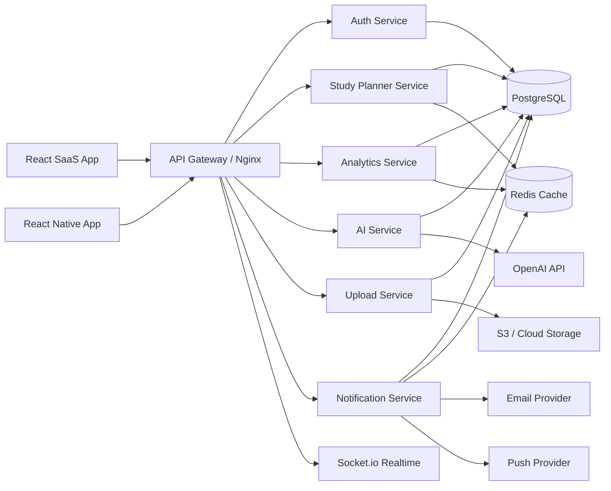

# Enterprise Architecture: AI GATE CSE EdTech SaaS

This project should evolve as a modular monolith first, then extract microservices by domain when traffic, team size, or deployment independence demands it. That keeps the current working product stable while making the architecture production-ready.

## 1. Target Enterprise Architecture



Why this helps: the app remains simple locally, but the boundaries are clear enough for production scaling, separate deployments, and future mobile clients.

## 2. Microservices Structure

Recommended future structure:

```text
apps/
  web/                         React web app
  mobile/                      React Native app
  api-gateway/                 routing, auth handoff, rate limits
services/
  auth-service/                login, refresh tokens, OAuth, 2FA, RBAC
  planner-service/             daily plans, revision scheduling, goals
  analytics-service/           dashboards, forecasts, learning behavior
  ai-service/                  OpenAI prompts, quiz, flashcards, explanations
  notification-service/        email, push, reminders, realtime events
  upload-service/              PDFs, notes, avatars, storage, versioning
packages/
  shared-config/               env validation, constants
  shared-types/                DTOs, API contracts
  shared-db/                   Prisma schema, migrations
  shared-ui/                   design system components
infra/
  docker/
  nginx/
  terraform/
  github-actions/
```

Current mapping in this repo:

- `server/controllers/authController.js` and `server/services/authService.js` become `auth-service`.
- `server/services/intelligenceService.js` and `revisionEngineService.js` become `planner-service`.
- `server/services/analyticsService.js` becomes `analytics-service`.
- `server/services/aiService.js` becomes `ai-service`.
- `server/services/notificationService.js` and `realtime/socket.js` become `notification-service`.
- `server/services/uploadService.js` and upload routes become `upload-service`.

## 3. Backend Service Structure

Current production-ready backend shape:

```text
server/
  config/                      environment and runtime config
  controllers/                 HTTP request handlers
  middleware/                  auth, RBAC, cache, security, logging
  routes/                      API surface
  services/                    business logic and service boundaries
  realtime/                    Socket.io gateway
  utils/                       logger, metrics, cache
  prisma/                      Prisma migration target
  tests/                       API tests
  scripts/                     DB setup scripts
```

Rule of thumb: controllers should stay thin, services should own business rules, and database access should move behind repository modules as the codebase grows.

## 4. DevOps Setup

Implemented scaffolding:

- `server/Dockerfile` for production API image.
- `client/Dockerfile` for static React build served by Nginx.
- `docker-compose.yml` with PostgreSQL, Redis, API, client, and gateway.
- `nginx/nginx.conf` for reverse proxying `/api`, `/socket.io`, `/health`, and the React app.
- `.github/workflows/ci.yml` for API tests, Prisma generation, client tests, and builds.

Recommended environments:

- `local`: local Node servers or Docker Compose.
- `staging`: production-like data, smaller resources, seeded test users.
- `production`: managed Postgres, managed Redis, object storage, CDN, WAF, monitoring.

## 5. Docker Configuration Strategy

API:

- Use a small Node Alpine runtime.
- Install only production dependencies.
- Inject secrets through environment variables.
- Run DB migrations/schema setup as a release step, not inside the web container.

Frontend:

- Build once with `REACT_APP_API_URL`.
- Serve static files with Nginx.
- Cache `/static/*` as immutable assets.

Gateway:

- Terminate HTTP routing at Nginx or cloud load balancer.
- Forward websocket upgrades for Socket.io.
- Keep SSL at Cloudflare, ALB, Render, Railway, or Nginx depending on platform.

## 6. CI/CD Workflow

Current workflow checks:

- API install, schema setup, Prisma generation, tests.
- Client install, tests, production build.
- Audit checks are present but non-blocking to avoid false release failures from CRA transitive dependencies.

Recommended deployment stages:

1. Pull request: test and build.
2. Merge to main: build Docker images.
3. Staging deploy: run migrations, smoke test `/health/deep`.
4. Production approval: deploy API, run migrations, deploy client, validate metrics.
5. Rollback: keep previous image tag and database backup snapshot.

## 7. Cloud Deployment Plan

AWS:

- Web: S3 + CloudFront or ECS service with Nginx.
- API: ECS Fargate behind ALB.
- Database: RDS PostgreSQL.
- Cache: ElastiCache Redis.
- Files: S3 with pre-signed uploads.
- Secrets: AWS Secrets Manager.
- Observability: CloudWatch, OpenTelemetry collector, Sentry.

Railway or Render:

- API as Node service.
- Managed PostgreSQL.
- Managed Redis if available.
- Static web as separate service or deploy client to Vercel.

Vercel:

- Best for the React frontend.
- Set `REACT_APP_API_URL` to the deployed API gateway.

Cloudflare:

- DNS, SSL, CDN, WAF, bot rules.
- Cache static assets.
- Route `/api/*` to backend origin.

## 8. Production Security Checklist

Implemented:

- Helmet security headers.
- Global and auth-specific rate limiting.
- Request body sanitization.
- CSRF protection for cookie-based refresh sessions.
- JWT access tokens plus refresh-token session table.
- HTTP-only refresh cookie support.
- RBAC middleware for admin routes.
- Parameterized PostgreSQL queries.
- Central error handling without production stack leaks.

Next hardening:

- Use long random secrets in production.
- Enforce HTTPS-only cookies behind TLS.
- Add OAuth providers through Passport or provider SDKs.
- Add real TOTP verification for 2FA.
- Add email provider for verification and reset flows.
- Add object storage virus scanning for uploads.
- Add Cloudflare WAF and bot protection.
- Add dependency scanning with Dependabot or Renovate.

## 9. Advanced Database Schema

Added or prepared:

- `user_sessions` for refresh-token session management.
- `password_reset_tokens` for password reset.
- `email_verification_tokens` for email verification.
- `oauth_accounts` for Google/GitHub OAuth.
- `user_mfa_settings` for 2FA.
- `study_groups`, `study_group_members`, `discussion_threads`, `discussion_comments` for collaboration.
- `file_versions` for secure file versioning.
- Additional indexes for sessions, discussions, uploads, analytics, and reminders.

Optimization strategy:

- Keep all user-scoped queries indexed by `user_id`.
- Cache dashboard/planner/insight reads for short TTLs.
- Move heavy analytics to scheduled snapshots.
- Use connection pooling through `pg` now, PgBouncer or managed pooling later.
- Use Prisma migrations as the long-term schema source of truth.

## 10. Redis Caching Strategy

Current implementation:

- `server/utils/cache.js` connects to Redis when `REDIS_URL` is configured.
- Falls back to in-memory cache locally.
- `cacheResponse` caches user-specific GET responses like analytics and planner output.

Recommended future keys:

```text
user:{id}:dashboard
user:{id}:planner:today
user:{id}:analytics:weekly
topic:{id}:ai:explanation
topic:{id}:pyq:trends
notifications:{userId}:unread
```

Invalidation:

- Invalidate user dashboard/planner cache when progress, PYQ, notes, goals, or revision data changes.
- Keep AI explanations longer because they are expensive and mostly stable.
- Keep notifications short-lived or event-driven.

## 11. Logging and Monitoring Strategy

Implemented:

- Winston structured logger.
- Request logging with method, path, status, duration, user ID, and IP.
- Lightweight in-process API metrics at `/api/metrics`.
- Deep health check at `/health/deep` and `/api/health/deep`.

Recommended production additions:

- Sentry for frontend and backend exceptions.
- OpenTelemetry traces for API, database, Redis, and OpenAI calls.
- Prometheus/Grafana or cloud-native metrics.
- Alerting on error rate, p95 latency, DB saturation, Redis failures, and upload failures.

## 12. Testing Strategy

Implemented:

- API smoke tests for health and security headers.
- CI runs API tests and frontend tests/builds.

Next tests:

- Unit tests for planner, revision engine, analytics, and auth token rotation.
- Integration tests for register/login/refresh/logout.
- Upload tests with PDF fixtures.
- Frontend component tests for dashboard, topic workspace, and auth flows.
- Playwright E2E for register, login, add session, upload syllabus, planner, and revision calendar.

## 13. Performance Optimization Plan

Implemented:

- Route-level React code splitting.
- Page skeleton loading states.
- Compression on API responses.
- Short-TTL API caching for expensive dashboard reads.
- Static asset caching in client Nginx.

Next performance work:

- Virtualize long topic/session tables.
- Add pagination to history endpoints.
- Move analytics forecasting to background jobs.
- Use CDN for static files and uploaded attachments.
- Add image/file transformations for avatars and notes.
- Prepare SSR migration only if SEO pages become important; the authenticated dashboard does not need SSR.

## 14. Scalable Frontend Architecture

Current frontend target:

```text
client/src/
  components/
    auth/
    charts/
    layout/
    progress/
    syllabus/
    ui/
  context/
  pages/
  services/
  styles/
```

Next enterprise structure:

```text
client/src/
  app/                         providers, router, query client
  features/
    auth/
    dashboard/
    planner/
    syllabus/
    analytics/
    collaboration/
  components/ui/               shared design system
  hooks/                       reusable data and UI hooks
  services/                    API clients
  theme/                       tokens, dark/light, accessibility
```

UI system direction:

- Keep reusable cards, panels, inputs, skeletons, badges, tables, dialogs, and charts.
- Use consistent tokens for spacing, radius, typography, and color.
- Add accessibility checks: focus states, labels, keyboard navigation, contrast, reduced motion.
- Keep enterprise dashboards dense, scannable, and task-oriented.

## 15. AI Product Architecture

Current:

- Rule-based planner and analytics stay available without an API key.
- `aiService` can call OpenAI when `OPENAI_API_KEY` is configured.
- AI endpoints support explanation, quiz generation, flashcards, and recommendations.

Production AI controls:

- Store prompt templates by feature.
- Cache expensive topic-level AI outputs.
- Add moderation and prompt-injection checks for uploaded notes.
- Keep human-readable fallback behavior when AI provider is unavailable.
- Track AI cost per user and feature.
- Add evaluation sets for generated quizzes and explanations.

## Migration Path

Phase 1: Production modular monolith.

- Keep current Express app.
- Use Docker, CI, security middleware, logging, Redis, and schema hardening.

Phase 2: Extract high-change domains.

- Move AI and notifications first because they have independent scaling and external providers.
- Add message queues for reminders, reports, and upload processing.

Phase 3: Enterprise scale.

- Dedicated services for auth, planner, analytics, upload, notification, and AI.
- Shared packages for types, contracts, database access, and design system.
- Full observability, canary deploys, backups, and disaster recovery.
